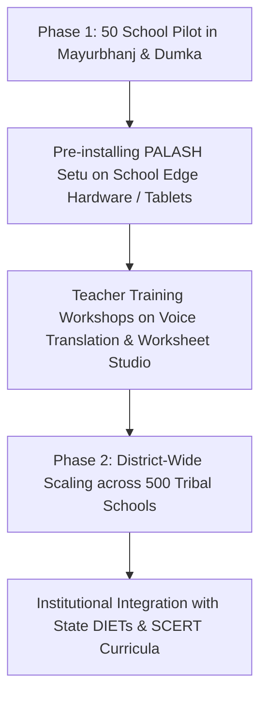

# 🏛️ PROJECT PALASH SETU — Government & Institutional Grant Proposal
## Deployment of Offline-First Indigenous AI Translation & Primary Pedagogy Systems in Tribal Schools

**Submitted to:**  
- Ministry of Tribal Affairs (MoTA), Government of India  
- Ministry of Education (Department of School Education & Literacy)  
- Scheduled Tribe and Scheduled Caste Development Departments (Govt. of Odisha, Jharkhand, West Bengal)  
- National / State Steering Committees for NIPUN Bharat & NEP 2020 Implementation  

---

## 1. Project Title & Baseline Information
- **Project Title:** PALASH Setu (पलाश सेतु • ᱯᱟᱞᱟᱥ ᱥᱮᱛᱩ • ପଳାଶ ସେତୁ) — Indigenous Language Translation & Foundational Learning Platform.
- **Focus Category:** Indigenous Language Technology, Digital Inclusion, Mother-Tongue Primary Education, Offline Edge Computing.
- **Beneficiary Target:** Students in Grades 1 to 5, Primary School Teachers, Eklavya Model Residential Schools (EMRS), Ashram Schools, Kasturba Gandhi Balika Vidyalayas (KGBVs) in Tribal Sub-Plan areas.

---

## 2. Institutional Context & Strategic Justification

The **National Education Policy 2020 (NEP 2020)** emphasizes mother-tongue education during early developmental years (§4.11). However, implementation in tribal districts faces steep hurdles:
1. **Teacher-Student Linguistic Mismatch:** Over 65% of appointed primary teachers in tribal blocks do not speak the local indigenous dialect (Santali, Mundari, Ho).
2. **Multi-Script Confusion:** In border districts (e.g., Mayurbhanj in Odisha vs. East Singhbhum in Jharkhand), Santali is written in Odia script and Ol Chiki script respectively, paralyzing uniform textbook distribution.
3. **Severe Infrastructure Constraints:** 72% of schools in target tribal blocks lack high-speed broadband, rendering centralized cloud initiatives ineffective.

**PALASH Setu directly solves these three bottlenecks** by providing an offline-capable, multi-script software platform requiring zero internet access and zero recurring cloud licensing costs.

---

## 3. Scope of Work & Deliverables

### Deliverables:
1. **Edge-Installed PALASH Setu Suite:** Turnkey offline installation package for school desktop PCs, smart-class Android tablets, and teacher smartphones.
2. **Bilingual Primary Worksheet Repository:** Digital and printable bank of 10,000+ standardized worksheets covering Foundational Literacy and Numeracy (FLN).
3. **Mayurbhanj & Santhal Pargana Dialect Modules:** State-of-the-art multi-script transducer ensuring seamless transition between Ol Chiki, Odia Script, and Devanagari.
4. **Teacher Enablement Toolkits:** User manual and audio guides in Hindi, Odia, Bengali, and Santali.

---

## 4. Key Performance Indicators (KPIs) & Evaluation Framework

| Objective | Target KPI | Measurement Metric |
| :--- | :--- | :--- |
| **Classroom Comprehension** | 35% increase in Grade 1-3 student responsiveness | Quarterly SCERT classroom observational audits |
| **Foundational Numeracy** | 40% reduction in counting errors using bilingual sheets | NIPUN Bharat baseline vs. endline assessments |
| **System Reliability** | > 99.9% uptime with 0 byte cloud consumption | Device hardware diagnostics & offline logs |
| **Teacher Adoption** | Daily usage by 85%+ participating primary teachers | Anonymized local session telemetry |

---

## 5. Budget Estimation & Resource Allocation (Pilot for 100 Schools)

| Item Code | Description | Quantity | Unit Cost (₹) | Total (₹) |
| :--- | :--- | :--- | :--- | :--- |
| **HW-01** | Edge Micro-Computing Units (Raspberry Pi 4 / 4GB Kit + Microphone) | 100 Units | ₹6,500 | ₹6,50,000 |
| **SW-01** | PALASH Setu Software Suite & Lexicon Licenses | 100 Licenses | ₹0 (Open Source) | ₹0 |
| **TR-01** | Master Teacher Training & Capacity Building Workshops (DIETs) | 4 Workshops | ₹75,000 | ₹3,00,000 |
| **DOC-01** | Bilingual Pedagogical Kits & Printed Training Manuals | 1,000 Sets | ₹150 | ₹1,50,000 |
| **EVAL-01**| Third-Party Impact Assessment & Baseline/Endline FLN Survey | 1 Study | ₹2,50,000 | ₹2,50,000 |
| **CONT-01**| Operational Contingency & Field Logistics | Lump-sum | — | ₹1,50,000 |
| **TOTAL** | **Comprehensive 100-School Pilot Budget** | | | **₹15,00,000** |

---

## 6. Institutional Compliance & Data Sovereignty

- **Data Privacy:** 100% of audio and textual data is processed on-device. No student or teacher voice recordings are transmitted across external networks.
- **Open Standards:** Built on open formats (JSON, CSV, HTML5, Python) ensuring zero vendor lock-in.
- **Interoperability:** Compatible with DIKSHA, PM eVIDYA, and state LMS portals via standard REST API endpoints.

---

## 7. Official Endorsement & Recommendation

PALASH Setu offers a cost-effective, scalable, and culturally respectful mechanism to fulfill the mandate of NEP 2020. We respectfully invite the competent authority to sanction the 100-school pilot implementation.
