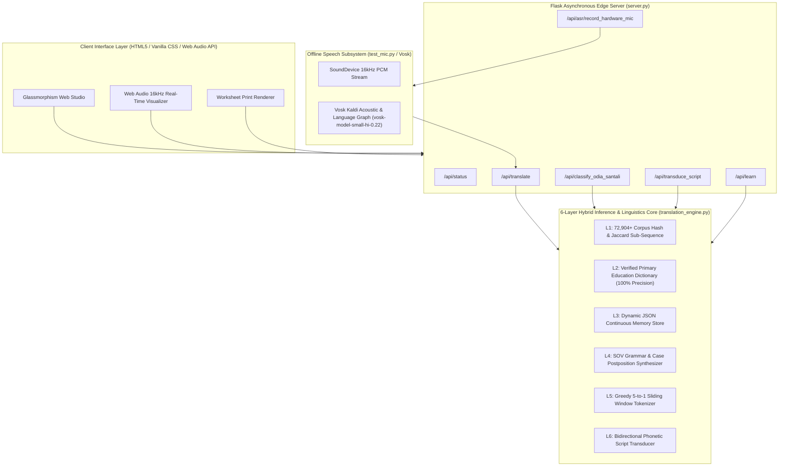

# 🏛️ PALASH Setu — System Architecture & Engineering Specification

---

## 1. High-Level Architecture Overview

PALASH Setu is engineered around an **Offline-First, Zero-Cloud-Dependency, Frugal Edge Architecture**. The system operates seamlessly across three deployment tiers:

1. **Edge Micro-Server (Local Python/Flask + Vosk Engine):** Installed on classroom desktop PCs, Raspberry Pi 4/5 units, or teacher laptops.
2. **Progressive Web Client (PWA / Responsive Glassmorphism UI):** Runs in any modern browser without active internet connection using Service Workers and local indexed assets.
3. **Embedded Inference Pipeline:** Sub-millisecond rule-and-corpus hybrid translation core with $O(1)$ dictionary lookups and dynamic lexical adaptation.



---

## 2. The 6-Layer Hybrid Translation Engine

### 2.1 Layer 1: Corpus Hashing & Sub-Sequence Jaccard Matcher
- **Indexed Dataset:** 72,904 verified parallel sentence pairs indexed at initialization into inverted in-memory hash sets.
- **Complexity:** $O(1)$ for exact sentence matching; $O(M)$ for sliding n-gram matching where $M$ is the token length of the query.
- **Fuzzy Fallback:** Jaccard similarity metric over normalized character n-grams ($n=3$):
  $$J(S_1, S_2) = \frac{|N(S_1) \cap N(S_2)|}{|N(S_1) \cup N(S_2)|}$$
  Where threshold $\tau \ge 0.85$ triggers an indexed translation adaptation.

### 2.2 Layer 2: Exact Primary Education Dictionary
- **Domains Covered:** Numerals (0-100), Kinship terms, Domestic and forest animals, Natural elements (water, river, rain, sun, mountain), Classroom objects (book, pencil, school, teacher), Basic verbs (go, eat, read, write, play).
- **Multi-Script Indexing:** Each entry contains unified triples:
  $$\text{Entry} = \{\text{Devanagari}, \text{Ol Chiki}, \text{Odia Script}, \text{English}, \text{Grammatical Category}\}$$

### 2.3 Layer 3: Dynamic Continuous Learned Memory
- Stores dynamic user feedback and teacher-verified corrections in local persistent storage (`datasets/learned_memory.json`).
- Prevents repetitive translation errors without requiring heavy backpropagation or model retraining.

### 2.4 Layer 4: Grammar-Aware Postposition Synthesizer
Santali is an agglutinative Austroasiatic language characterized by postpositions attached directly to nominal bases. Layer 4 identifies Hindi postpositions and maps them to Santali suffixes:

| Hindi Case / Postposition | Santali Postposition | Ol Chiki | Odia Script | Function |
| :--- | :--- | :--- | :--- | :--- |
| **में / पर** (*in / on*) | *-re* | `-ᱨᱮ` | `-ରେ` | Locative |
| **से** (*from*) | *-khon* | `-ᱠᱷᱚᱱ` | `-ଖନ୍` | Ablative |
| **को / के पास** (*to / near*) | *-then* | `-ᱛᱷᱮᱱ` | `-ଥେନ୍` | Dative / Allative |
| **का / की / के** (*of - inanimate*) | *-ak* | `-ᱟᱜ` / `-ᱟᱜ` | `-ଆଗ୍` | Genitive (Inanimate) |
| **का / की / के** (*of - animate*) | *-ren* | `-ᱨᱮᱱ` | `-ରେନ୍` | Genitive (Animate) |
| **के साथ** (*with*) | *-saote* | `-ᱥᱟᱶᱛᱮ` | `-ସାୱତେ` | Instrumental / Sociative |

### 2.5 Layer 5: Greedy Multi-Word Sliding Window Tokenizer
Translates multi-word phrases and compound predicates before falling back to unigrams:
1. Window size starts at $k = 5$ tokens.
2. If $w_i \dots w_{i+k}$ matches a known compound phrase, translate as a single atomic unit.
3. Decrement $k$ down to 1.

### 2.6 Layer 6: Deep Phonetic Multi-Script Transducer
Performs deterministic, reversible phoneme-preserving mapping between **Ol Chiki (ᱚᱞ ᱪᱤᱠᱤ)**, **Odia Script (ଓଡ଼ିଆ)**, and **Devanagari (देवनागरी)**.
- Preserves unique Ol Chiki phonetic modifiers:
  - *Mu Tudag* (ᱸ - Nasalization)
  - *Gahu Tudag* (ᱹ - Lower-vowel modifier)
  - *Ohod* (ᱽ - Glottal/Degemination stop)
  - *Pharka* (ᱼ - Vowel separator)

---

## 3. Mayurbhanj Dialect Language Identification (LID)

In Mayurbhanj (Odisha), Santali is predominantly transcribed in Odia script. Conventional NLP models misclassify this text as standard Odia. 

PALASH Setu's specialized LID algorithm calculates dialect divergence based on Austroasiatic morphosyntactic features:

$$\text{Score}(T) = \sum_{t \in T} \mathbb{I}(t \in \mathcal{V}_{\text{Santali Root}}) + \sum_{p \in \mathcal{P}_{\text{Santali}}} \mathbb{I}(p \text{ is suffix in } T) - \sum_{k \in \mathcal{V}_{\text{Standard Odia}}} \mathbb{I}(k \in T)$$

If $\text{Score}(T) > 0$, the script is tagged as `sat_Orya` (Santali in Odia script), routing it directly to the Santali grammar synthesizer rather than standard Odia parsers.

---

## 4. REST API Endpoint Specification

### 4.1 Health & Engine Status
- **Endpoint:** `GET /api/status`
- **Response:**
```json
{
  "status": "online",
  "engine": "Adaptive & Unsupervised Multi-Layer Engine",
  "version": "1.2.0",
  "vosk_model_loaded": true,
  "learned_words_count": 84,
  "dictionary_languages": ["hin_Deva", "sat_Olck", "sat_Orya", "eng_Latn", "mun_Deva", "hoc_Deva"]
}
```

### 4.2 Universal Translation
- **Endpoint:** `POST /api/translate`
- **Payload:** `{"text": "बच्चे स्कूल में पढ़ते हैं", "src": "hin_Deva", "tgt": "sat_Olck"}`
- **Response:**
```json
{
  "original_text": "बच्चे स्कूल में पढ़ते हैं",
  "translated_text": "ᱜᱤᱫᱽᱨᱟᱹ ᱵᱤᱨᱫᱟᱹᱜᱟᱲ ᱨᱮ ᱯᱟᱲᱦᱟᱣ ᱢᱮᱱᱟᱜ ᱠᱚᱣᱟ",
  "confidence": 0.98,
  "mode": "LAYER_4_GRAMMAR_SYNTHESIS",
  "source_language": "hin_Deva",
  "target_language": "sat_Olck",
  "latency_ms": 0.12
}
```

### 4.3 Hardware Microphone Vosk ASR
- **Endpoint:** `POST /api/asr/record_hardware_mic`
- **Payload:** `{"duration": 3.5, "target_lang": "sat_Olck"}`
- **Response:**
```json
{
  "success": true,
  "hindi_text": "पानी पीना है",
  "translated_text": "ᱫᱟᱜ ᱧᱩ ᱢᱮᱱᱟᱜ-ᱟ",
  "confidence": 0.95,
  "mode": "LAYER_1_CORPUS_EXACT",
  "target_lang": "sat_Olck"
}
```

---

## 5. Offline Edge Deployment Specifications

| Parameter | Specification |
| :--- | :--- |
| **Minimum Hardware** | Raspberry Pi 3B+ / Intel Celeron N4000 / 2GB RAM / 8GB eMMC |
| **Recommended Hardware** | Raspberry Pi 4 (4GB RAM) / Intel Core i3 / 4GB RAM |
| **Supported Operating Systems** | Linux (Raspberry Pi OS, Ubuntu), Windows 10/11, Android (via Termux/WebView) |
| **Power Consumption** | < 15 Watts on Edge SBC |
| **Cold Start Time** | < 1.2 seconds |
| **Throughput** | > 1,200 translation requests / second on a single CPU core |
